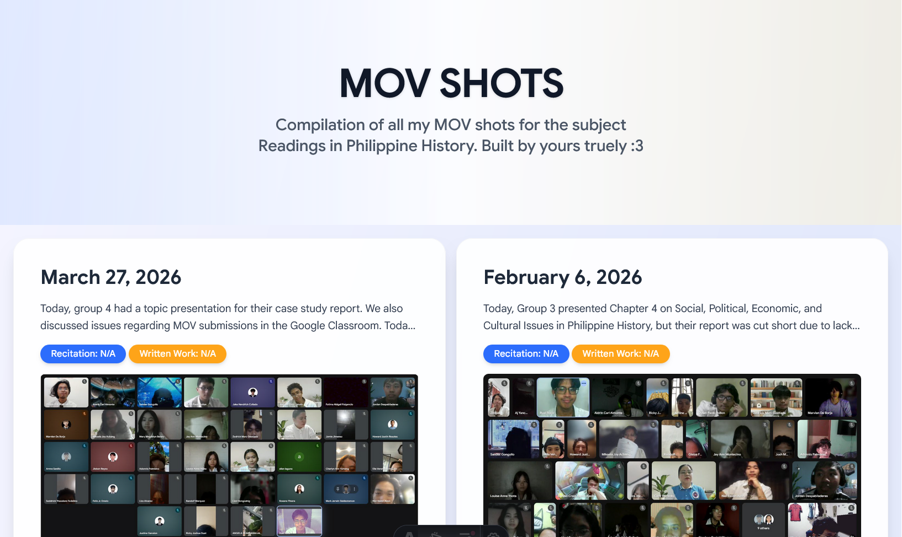

<h1 align="center">MOV Shots</h1>

<p align="center"><i>Compilation of all my MOV shots for the subject Readings in Philippine
				History.</i></p>

<div align="center">
   <!-- FIND PREMADE BADGES HERE: https://github.com/Ileriayo/markdown-badges -->
   <a href="https://astro.build"></a>
   <a href="https://sqlite.org/"></a>
   <a href="./LICENSE"></a>
   <a href="https://github.com/jrwnnnn/mov/stargazers"></a>
   <a href="https://github.com/jrwnnnn/mov/actions"></a>
</div>

<br>



<br>

A personal web app I built to compile/organize my MOVs for my Readings in Philippine History class. Replaces the manual grind of formatting narrative reports and timestamped attendance screenshots into PDFs every session, everything's compiled, organized, and persistent. Built with Astro + LibSQL (and love).

## Prerequisites

Make sure the following are installed:

- [Node.js](https://nodejs.org/en/download/current)

## Development

```bash
#Clone the repository
git clone https://github.com/jrwnnnn/mov.git
cd mov

#Install the required dependencies
npm install

#Run the program
npm run atsro:dev
```

## License

Distributed under the MIT License.
Copyright (c) 2026 Mark Jerwin(@jrwnnnn). All rights reserved.

See the See the [LICENSE](LICENSE) file for full details.

Permission is hereby granted, free of charge, to any person obtaining a copy of this software and associated documentation files (the "Software"), to deal in the Software without restriction, including without limitation the rights to use, copy, modify, merge, publish, distribute, sublicense, and/or sell copies of the Software, and to permit persons to whom the Software is furnished to do so, subject to the following conditions:

The above copyright notice and this permission notice shall be included in all copies or substantial portions of the Software.

## Contributors

<a href="https://github.com/jrwnnnn/mov/graphs/contributors">
  
</a>

<br>
<br>


